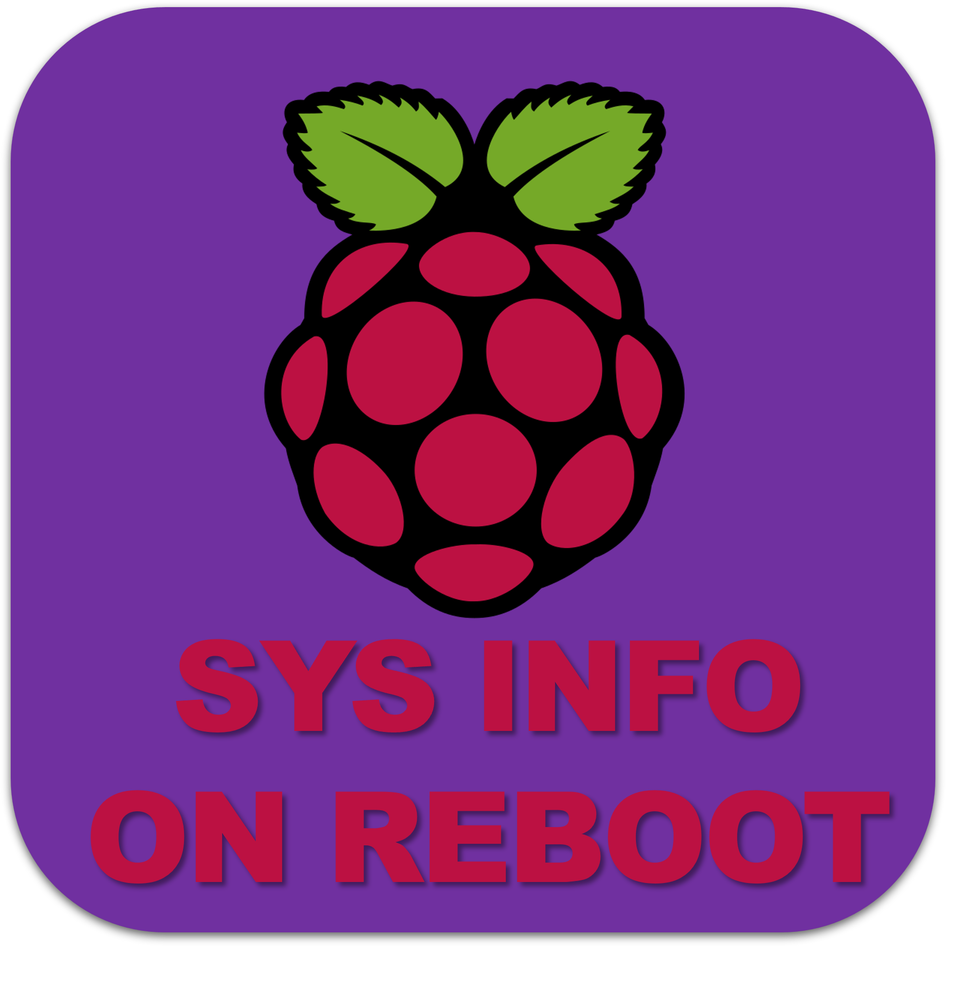

# Send Systeminformation over TEAMS Webhook



## Setup

Update ;)

```
sudo apt update && sudo apt upgrade -y
```

clone the Repository

```
git clone git@github.com:alexsagarra/sendsysinfo.git
```

```

cd sendsysinfo
python3 -m venv .venv
source .venv/bin/activate
pip install -r requirements_minimal.txt
```

## Script

create the .env file (copy the example)

```
python main.py
```

## CRON
